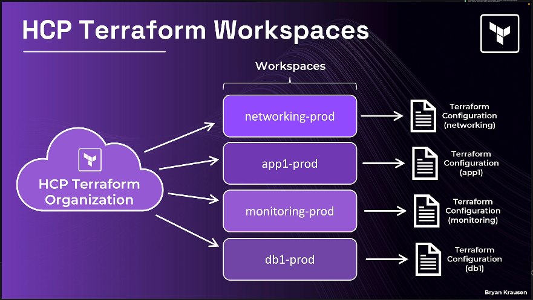
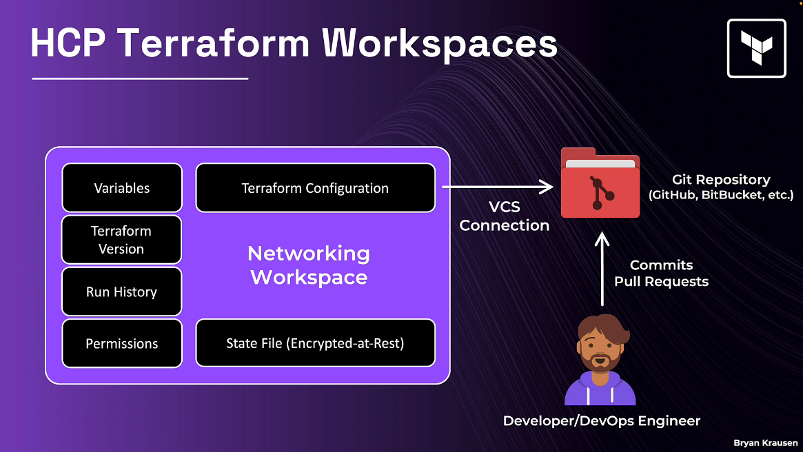

## HCP tokens 

### Organization tokens

* used to manage teams, membership, and workspaces
* Does not have permissions to run plans and applies

### Team tokens

* Often used by automated services, like CI/CD pipelines
* Can run terraform operations

### User tokens

* Same permission level as your user account
* Only type of token that can access multiple organizations

### Audit tokens

* Provides read-only access
* Used for accessing the audit trail api

### Accessing terraform registry without a browser

* Set the environment variable: TF_TOKEN_app_terraform_io=<token>

## HCP terraform workspaces

A workspace is everything terraform needs to manage a collection of infrastructure

* Terraform configuration (Linked via Version controlled system or uploaded via CLI)
* State file (with version history and rollback capacity)
* Variables (Terraform variables + environment variables, with sensitive marking)
* Run history (full audit trail of every plan/apply)
* Execution settings (mode, terraform versio, auto-apply)
* Control over Team access and permissions 

> Each workspace uses its own terraform version

### Execution Modes

* Local Execution -> Running in your local machine
* Remote execution -> Running inside hashicorp cloud platform 
* Agent execution -> This is used for those cases where hcp terraform can't reach the infrastructure - run your own lightweight hcp terraform - terraform enterprise use the same agent to evaluate policies when running terraform operations

## HCP workflow types

### Version Control workflow

1. Trigger runs based on changes to configuration in repositories
2. Best for those who need traceability and transparency

### CLI-Driven workflow

1. Trigger runs in a workspace using the terraform cli
2. Best for those comfortable with terraform cli - direct control

### API-Driven workflow

1. Trigger runs using the HCP terraform API
2. Best for those with custom integrations and pipelines - complex customizations

> Most complete but also the most complex

## Login

`export TF_TOKEN_app_terraform_io="Token"`